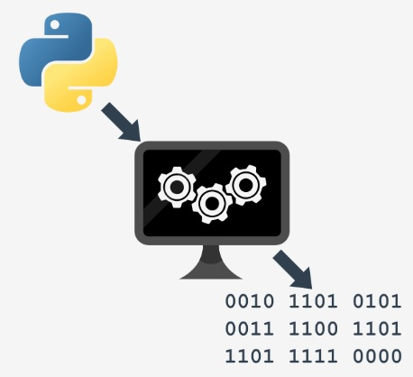
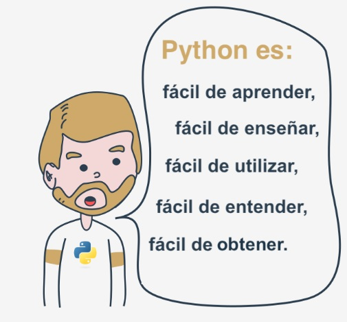
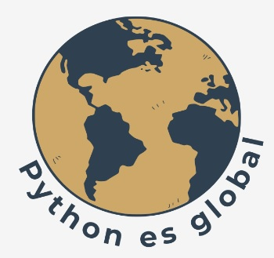
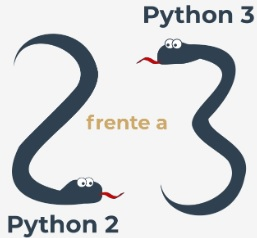
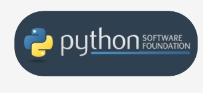
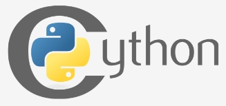
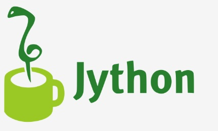
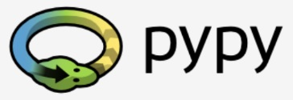

# Fundamentos de Python 1:
# Módulo 1
# Introducción a Python y a la programación de computadoras.

En este módulo, aprenderás sobre:

Los fundamentos de la programación de computadoras, es decir, cómo funciona la computadora, 
cómo se ejecuta el programa, cómo se define y construye el lenguaje de programación.

La diferencia entre compilación e interpretación.

Qué es Python, cómo se posiciona entre otros lenguajes de programación y qué 
distingue las diferentes versiones de Python.

# ¿Cómo funciona un programa de computadora?
Este curso tiene como objetivo explicar el lenguaje Python y para que se utiliza. Vamos a comenzar desde los fundamentos básicos.

Un programa hace que una computadora sea utilizable. Sin un programa, una computadora, incluso la más poderosa, no es más que 
un objeto. Del mismo modo, sin un pianista, un piano no es más que una caja de madera.

Las computadoras pueden realizar tareas muy complejas, pero esta habilidad no es innata. La naturaleza de una computadora 
es bastante diferente.

Una computadora puede ejecutar solo operaciones extremadamente simples, por ejemplo, una computadora no puede comprender el valor 
de una función matemática complicada por sí misma, aunque esto no está más allá de los límites posibles en un futuro próximo.

Las computadoras contemporáneas solo pueden evaluar los resultados de operaciones muy fundamentales, como sumar o dividir, 
pero pueden hacerlo muy rápido y pueden repetir estas acciones prácticamente cualquier cantidad de veces.

Imagina que quieres conocer la velocidad promedio que has alcanzado durante un largo viaje. Sabes la distancia, sabes el tiempo, 
necesitas la velocidad.

Naturalmente, la computadora podrá calcular esto, pero la computadora no es consciente de cosas como la distancia, la velocidad o 
el tiempo. Por lo tanto, es necesario instruir a la computadora para que:

-Acepte un número que represente la distancia.
-Acepte un número que represente el tiempo de viaje.
-Divida el valor anterior entre el segundo y almacene el resultado en la memoria.
-Muestre el resultado (representando la velocidad promedio) en un formato legible.

Estas cuatro acciones simples forman un programa. Por supuesto, estos ejemplos no están formalizados, y están muy lejos de lo que 
la computadora puede entender, pero son lo suficientemente buenos como para traducirlos a un lenguaje que la computadora pueda aceptar.

La palabra clave es el lenguaje.

# Lenguajes naturales frente a lenguajes de programación
Un lenguaje es un medio (y una herramienta) para expresar y registrar pensamientos. Hay muchos lenguajes a nuestro alrededor. 
Algunos de ellos no requieren hablar ni escribir, como el lenguaje corporal. Es posible expresar tus sentimientos más profundos de 
manera muy precisa sin decir una sola palabra.

Otro lenguaje que empleas cada día es tu lengua materna, que utilizas para manifestar tu voluntad y para pensar en la realidad. Las 
computadoras también tienen su propio lenguaje, llamado lenguaje máquina, el cual es muy rudimentario.

Una computadora, incluso la más técnicamente sofisticada, carece incluso de un rastro de inteligencia. Se podría decir que es como un 
perro bien entrenado, responde solo a un conjunto predeterminado de comandos conocidos.

Los comandos que reconoce son muy simples. Podemos imaginar que la computadora responde a órdenes como "Toma este número, 
divídelo entre otro y guarda el resultado".

Un conjunto completo de comandos conocidos se llama lista de instrucciones, a veces abreviada IL (por sus siglas en inglés). Los 
diferentes tipos de computadoras pueden variar según el tamaño de sus IL y las instrucciones pueden ser completamente diferentes 
en diferentes modelos.

Nota: los lenguajes máquina son desarrollados por humanos.

Ninguna computadora es actualmente capaz de crear un nuevo idioma. Sin embargo, eso puede cambiar pronto. Por otro lado, las 
personas también usan varios idiomas muy diferentes, pero estos idiomas se crearon ellos mismos. Además, todavía están evolucionando.

Cada día se crean nuevas palabras y desaparecen las viejas. Estos lenguajes se llaman lenguajes naturales.

# ¿Qué compone a un lenguaje?
Podemos decir que cada lenguaje (máquina o natural, no importa) consta de los siguientes elementos:

-Un alfabeto: un conjunto de símbolos utilizados para formar palabras de un determinado lenguaje (por ejemplo, el alfabeto 
latino para el inglés, el alfabeto cirílico para el ruso, el kanji para el japonés, y así sucesivamente).

-Un léxico: (también conocido como diccionario) un conjunto de palabras que el lenguaje ofrece a sus usuarios (por ejemplo, la 
palabra "computadora" proviene del diccionario en inglés, mientras que "cmoptrue" no; la palabra "chat" está presente en los 
diccionarios de inglés y francés, pero sus significados son diferentes.

-Una sintaxis: un conjunto de reglas (formales o informales, escritas o interpretadas intuitivamente) utilizadas para precisar si una 
determinada cadena de palabras forma una oración válida (por ejemplo, "Soy una serpiente" es una frase sintácticamente 
correcta, mientras que "Yo serpiente soy una" no lo es).

-Una semántica: un conjunto de reglas que determinan si una frase tiene sentido (por ejemplo, "Me comí una dona" tiene sentido, 
pero "Una dona me comió" no lo tiene).

La IL es, de hecho, el alfabeto de un lenguaje máquina. Este es el conjunto de símbolos más simple y principal que podemos usar 
para dar comandos a una computadora. Es la lengua materna de la computadora.

Desafortunadamente, esta lengua está muy lejos de ser una lengua materna humana. Ambos (tanto las computadoras como los 
humanos) necesitamos algo más, un lenguaje común para las computadoras y los seres humanos, o un puente entre los dos mundos 
diferentes.

Necesitamos un lenguaje en el que los humanos puedan escribir sus programas y un lenguaje que las computadoras puedan usar para 
ejecutar los programas, que es mucho más complejo que el lenguaje máquina y más sencillo que el lenguaje natural.

Tales lenguajes son a menudo llamados lenguajes de programación de alto nivel. Son algo similares a los naturales en que usan 
símbolos, palabras y convenciones legibles para los humanos. Estos lenguajes permiten a los humanos expresar comandos a las 
computadoras que son mucho más complejos que las instrucciones ofrecidas por las IL.

Un programa escrito en un lenguaje de programación de alto nivel se llama código fuente (en contraste con el código de máquina 
ejecutado por las computadoras). Del mismo modo, el archivo que contiene el código fuente se llama archivo fuente.

# La compilación frente a la interpretación
La programación de computadora es el aco de establecer una secuencia de instrucciones con la cual se causará el efecto deseado. El 
efecto podría ser diferente en cada caso específico: depende de la imaginación, el conocimiento y la experiencia del programador.

Por supuesto, tal composición tiene que ser correcta en muchos sentidos, tales como: 

-Alfabéticamente: un programa debe escribirse en una secuencia de comandos reconocible, por ejemplo, el Romano, Cirílico, etc.

-Léxicamente: cada lenguaje de programación tiene su diccionario y necesitas dominarlo; afortunadamente, es mucho más
simple y más pequeño que el diccionario de cualquier lenguaje natural.

-Sintácticamente: cada idioma tiene sus reglas y deben ser obedecidas.

- Semánticamente: El programa tiene que tener sentido.

Desafortunadamente, un programador también puede cometer errores en cada uno de los cuatro sentidos anteriores. Cada uno de
ellos puede hacer que el programa se vuelva completamente inútil.

Supongamos que has escrito correctamente un programa. Cómo persuadimos a la computadora para que lo ejecute? Tienes que
convertir tu programa en lenguaje máquina. Afortunadamente, la traducción puede ser realizada por la computadora, haciendo que
todo el proceso sea rápido y eficiente.

Existen dos formas diferentes de transformar un programa de un lenguaje de programación de alto nivel a un lenguaje de máquina:

- Compilación: el programa fuente se traduce una vez (sin embargo, esta ley debe repetirse cada vez que se modifique el código
fuente) obteniendo un archivo (por ejemplo, un archivo .exe si el código esta diseñado para ejecutarse en MS Windows) que contiene
el código máquina; ahora puedes distribuir el archivo en todo el mundo; el programa que realiza esta traducción se llama compilador o
traductor.

- Interpretación: tú (o cualquier usuario del código) puedes traducir el programa fuente cada vez que se ejecute; el programa
que realiza este tipo de transformación se denomina intérprete, ya que interpreta el código cada vez que está destinado a ejecutarse;
también significa que no puede distribuir el código fuente tal como está, por que el usuario final también necesita que el intérprete lo
ejecute.

Debido a algunas razones muy fundamentales, un lenguaje de programación de alto nivel en particular está diseñado para caer en una 
de estas dos categorías.

Existen muy pocos idiomas que puedan ser tanto compilados como interpretados. Por lo general, un lenguaje de programación se
proyecta con este factor en la mente de sus constructores: Se compilará o se interpretará?

# Qué hace realmente el intérprete?
Supongamos una vez más que has escrito un programa. Ahora , existe como un archivo de computadora: un programa de
computadora es en realidad una pieza de texto, por lo que el código fuente generalmente se coloca en archivos de texto.

Nota: debe ser texto puro, sin ninguna decoración, como diferentes fuentes, colores, imágenes incrustadas u otros medios. Ahora 
tienes que invocar al intérprete y dejar que lea el archivo fuente.

El inérprete lee el código fuente de una manera que es común en la cultura occidental: de arriba hacia abajo y de izquierda a derecha.
Hay algunas excepciones: se cubrirán más adelante en el curso.

En primer lugar, el intérprete verifica si todas las líneas subsiguientes son correctas (utilizando los cuatro aspectos tratados
anteriormente).

Si el intérprete encuentra un error, termina su trabajo inmediatamente. El único resultado en este caso es un mensaje de error.

El intérprete te informará dónde se encuentra el error y qué lo causó. Sin embargo, estos mensajes pueden ser engañosos, ya que el
intérprete no puede seguir tus intenciones exactas y puede detectar errores a cierta distancia de sus causas reales.

Por ejemplo, si intentas usar una entidad de un nombre desconocido, causará un error, pero el error se descubrirá en el lugar donde
se intenta usar la entidad, no donde se introdujo el nombre de la nueva entidad.

En otras palabras, la razón real generalmente se ubica un poco antes en el código, por ejemplo, en el lugar donde se tuvo que informar
al intérprete de que usarías la entidad del nombre.  

Si la línea se ve bien, el intérprete intenta ejecutarla (nota: cada línea generalmente se ejecuta por separado, por lo que el trío "Lectura
- Verificación - Ejecución", puede repetirse muchas veces, más veces que el número real de líneas en el archivo fuente, debido a que
algunas partes del código pueden ejecutarse más de una vez).

También es posible que una parte significativa del código se ejecute con éxito antes de que el intérprete encuentre un error. Este es el
comportamiento normal en este modelo de ejecución.

Puedes preguntar ahora, cuál es mejor? El modelo de compilación o el modelo de interpretación? No hay una respuesta obvia. Si
lo hubiera, uno de estos modelos habría dejado de existir hace mucho tiempo. Ambos tienen sus ventajas y sus desventajas.

# La compilación frente a la interpretación - Ventajas y desventajas

<table style="width: 100%; text-align: center;">
  <tr>
    <td style="width: 33%;">Primera columna</td>
    <td style="width: 33%;">Segunda columna</td>
    <td style="width: 33%;">Tercera columna</td>
  </tr>
  <tr>
    <td colspan="3" style="width: 100%; padding-top: 50px;">Más contenido</td>
  </tr>
  <tr>
    <td  colspan="3" style="width: 100%; padding-top: 50px;">Pie de página</td>
  </tr>
</table>

## **Qué es Python?**
Python es un lenguaje de programación de alto nivel, interpretado, orientado a objetos y de uso generalizado con semántica dinámica,
que se utiliza para la programación de propósito general.

Aunque puede que conozcas a la pitón como una gran serpiente, el nombre del lenguaje de programación Python proviene de una 
vieja serie de comedia de la BBC llamada **Monty Phyton's Flying Circus**.

En el apogeo de su éxito, el equipo de Monty Python es considerado uno de los dos nutrientes fundamentales para un programador (el otro es la pizza), el creador
de Python nombró el lenguaje en honor al programa de televisión.

## **Quién creó Python?
Una de las grandes características sorprendentes de Python es el hecho de que enrealidad es el trabajo de una persona. Por lo general, los
grandes lenguajes de programación son desarrollados y publicados por grandes compañias que emplean a muchos profesionales, y 
debido a las normas de derechos de autor, es muy difícil nombrar a cualquiera de las personas involucradas en el protecto. Python es
una excepción.

No existen muchos lenguajes de programación cuyos autores sean conocidos por su nombre. Python fue creado por [Guido van Rossum](https://en.wikipedia.org/wiki/Guido_van_Rossum)
nacido en 1956 en Haarlem, Países Bajos. Por supuesto, Guido van Rossum no desarrolló y evolucionó todos los 
componentes de Python.

LA velocidad con la que Python se ha exendido por todo el mundo es el resultado del trabajo continuo de miles de (muy a menudo
anónimos) programadores, testers, usuarios (muchos de ellos no son especialistas en TI) y entusiastas, pero hay que decir que la 
primera idea (la semilla de la que brotó Python) llegó a una cabeza: la de Guido.

## **Un proyecto de programación por hobby**
Las circunstancias en las que se creó Python son un poco desconcertantes. Según Guido van Rosssum:  

'''
En Diciembre de 1989, estaba buscando un proyecto de programación de "pasatiempo" que me mantendría ocupado durante la
semana de navidad. Mi oficina (...) estaría cerrada, pero tenía una computadora en casa y no mucho más en mis manos. Decidí
escribir un intérprete para el nuevo lenguaje de scripting en el que había estado pensando últimamente: un descendiente de
ABC que atraería a los hackers de Unix/C. Elegí Python como el título de trabajo para el proyecto, estando en un estado de ánimo
ligeramente irreverente (y un gran fanático de Monty Python's Flying Circus).
*- Guido van Rossum*
'''

## **Los objetivos de Python**
En 1999, Guido van Rossum definió sus objetivos para Python:

- Un lenguaje **fácil e intuitivo** tan poderoso como los de los principales competidores.
- De **código abierto**, para que cualquiera pueda contribuir a su desarrollo.
- El código que es tan **comprensible** como el inglés simple.
- **Adecuado para tareas cotidianas**, permitiendo tiempos de desarrollo cortos.

Unos 20 años después, está claro que todas esas intenciones se han cumplido. Algunas fuentes dicen que Python es el lenguaje de
programación más popular del mundo, mientras que otros afirman que es el tercero o el quinto.

  

De cualquier manera, todavía ocupa un alto rango en el top ten de [PYPL PopularitY of Programming Language y el TIOBE Programming Community Index](https://pypl.github.io/PYPL.html).

Python no es una lengua joven. **Es maduro y digno de confianza**. No es una maravilla de un solo hit. Es una estrella brillante en el
firmamento de la programación, y el tiempo dedicado a aprender Python es muy buena inversión. 

## **Qué hace especial a Python?**

Por qué los programadores, jóvenes y viejos, experimentados y novatos, quieren usarlo?
Cómo fue que las grandes empresas adoptaron Python e implementaron sus productos al 
usarlo?

Existen muchas razones. Ya hemos enumerado algunas de ellas, pero vamos a enumerarlas 
de una manera más práctica:

- Es **fácil de aprender**: el tiempo necesario para aprender Python es más corto que en 
muchos otros lenguajes; esto significa que es posible comenzar la programación real
más rápido.

- Es **fácil de enseñar**: la carga de trabajo de enseñanza es menor que la que necesitan
otros lenguajes; esto significa que el profesor puede poner más énfasis en las técnicas
de programación generales (independientes del lenguaje), no gastando energía en
trucos exóticos, extrañas excepciones y reglas incomprensibles.

- Es **fácil de utilizar**: para escribir software nuevo; a menudo es posible escribir código
más rápido cuando se emplea Python.

- Es **fácil de entender**: a menudo, también es más fácil entender el código de otra
persona más rápido si esta escrito en Python.

- Es**fácil de obtener, instalar y desplegar**: Python es gratuito, abierto y
multiplataforma; no todos los lenguajes pueden presumir de eso.  

Por supuesto, Python también tiene sus inconvenientes:

- No es un demonio de la velocidad: Python no ofrece un rendimiento excepcional.

- En algunos casos puede ser resistente a algunas técnicas de prueba simples, lo que
puede significar que la depuración del código de Python puede ser más difícil que con
otros lenguajes. Afortunadamente, el cometer errores es más difícil en Python.

  

También debe señalarse que Python no es la única solución de este tipo disponible en el
mercado de TI.

Tiene muchos seguidores, pero hay muchos que prefieren otros lenguajes y nisiquiera 
consideran Python para sus proyectos.

## **Rivales de Python?**
Python tiene dos competidores directos, con propiedades y predisposiciones comparables.
Estos son:

- **Perl**: un lenguaje de scripting originalmente escrito por Larry Wall.
- **Ruby**: un lenguaje de scripting originalmente escrito por Yukihiro Matsumoto.

El primero es más tradicional, más conservador que Python, y se parece a algunos de los 
buenos lenguajes antiguos derivados del lenguaje de programación C clásico.

En contraste, este último es más innovador y está más lleno de ideas nuevas. Python se 
encuentra en algún lugar entre estas dos creaciones.

Internet está lleno de foros con discusiones infinitas sobre la superioridad de uno de estos
tres sobre los otros, por si deseas obtener más informmación sobre cada uno de ellos.

## **Dónde podemos ver a Python en acción?**
Lo vemos todos los días y en casi todas partes. Se utiliza ampliamente para impementar
complejos **Servicios de internet** como motores de búsqueda, almacenamiento en la nube
y herramientas, redes sociales, etc. Cuando utilizas cualquiera de estos servicios, en 
realidad estás muy cerca de Python.

Muchas **Herramientas de desarrollo** se implementan en Python. Cada vez se escriben más
**aplicaciones de uso diario** en Python. Muchos **Científicos** han abandonado las costosas 
herramientas patentadas y se han cambiado a Python. Muchos **testers** de proyectos de TI
han comenzado a usar Python para llevar a cabo procedimientos de prueba repetibles. La
lista es larga.  

## **Por qué no Python?**
A pesar de la creciente popularidad de Python, todavía existen algunos nichos en los que
Python está ausente o rara vez se ve:

- **Programación de bajo nivel** (a veces llamada programación "baremetal"): si deseas
implementar un controlador o motor gráfico extremadamente efectivo, no se usaría Python.

- **Aplicaciones para dispositivos móviles**: este territorio aún está a la espera de ser
conquistado por Python, lo más probable es que suceda algún día.

## **Existe más de un Python**
Existen dos tipos principales de Python, llamados Python 2 y Python 3.

Python 2 es una versión anterior del Python original. Su desarrollo se ha estancado
intencionalmente, aunque eso no significa que no haya actualizaciones. Por el contrario, las
actualizaciones se emiten de forma regular, pero no pretenden modificar el idioma de
manera significativa. Prefieren arreglar cualquier error recién descubierto y agujeros de
seguridad. La ruta de desarrollo de Python 2 ya ha llegado a un callejón sin salida, pero
Python 2 en sí todavía está muy vivo.

**Python 3 es la versión más nueva (para ser precisos, la actual) del lenguaje. Está**
**atravesando su propio camino de evolución, creando sus propios estándares y**
**hábitos.**

Estas dos versiones de Python no son compatibles entre sí. Las secuencias de comandos de
Python 2 no se ejecutarán en un entorno de Python 3 y viceversa, por lo que si deseas que
un intérprete de Python 3 ejecute el código Python 2 anterior, la única solución posible es
volver a escribirlo, no desde cero, por supuesto. Grandes partes del código pueden
permanecer intactas, pero tienes que revisar todo el código para encontrar todas las
incompatibilidades posibles. Desafortunadamente, este proceso no puede ser
completamente automatizado.

Es demasiado difícil, consume mucho tiempo, es demasiado caro y es demasiado
arriesgado migrar una aplicación Python 2 antigua a una nueva plataforma. Es posible que
reescribir el código le introduzca nuevos errores. Es más fácil y mas sensato dejar estos
sistemas solos y mejorar el intérprete existente, en lugar de intentar trabajar dentro del
código fuente que ya funciona.

  

Python 3 no es solo una versión mejorada de Python 2, es un lenguaje completamente diferente,
aunque es muy similar a su predecesor. Cuando se miran a distancia, parecen ser el
el mismo, pero cuando se observan de cerca, se notan muchas diferencias.

Si estás modificando una solución de Python existente, entonces es muy probable que esté
codificada en Python2. Esta es la razón por la que Python 2 todavía está en uso. Hay
demasiadas aplicaciones de Python 2 existentes para descartarlo por completo.

***NOTA***
'''
Si se va a comenzar un nuevo proyecto de Python, **deberías usar Python 3, esta es la**
**versión de Python que se usará durante este curso.**

Es importante recordar que puede haber diferencias mayores o menores entre las
siguientes versiones de Python 3 (p. Ej., Python 3.6 introdujo claves de diccionario
ordenadas de forma predeterminada en la implementación de CPython). La buena noticia
es que todas las versiones más nuevas de Python 3 son **compatibles** con las versiones
anteriores de Python 3. Siempre que sea signficiativo e importante, intentaremos resaltar
esas diferencias en el curso.

Todos los ejemplos de código que encontrarás durante el curso se han probado con Python
3.4, Python 3.6, Python 3.7 y Python 3.8.
'''

## **Python alias CPython**
Además de Python 2 y Python 3, existe más de una versión de cada uno.  

  

En primer lugar, están los Pythons que se mantienen por las personas reunidas en torno
a PSF [Python Software Foundation](https://www.python.org/psf-landing/) , una comunidad que tiene como objetivo desarrollar,
mejorar, expandir y popularizar Python y su entorno. El presidente del PSF es el propio
Guildo van Rossum, y por esta razón, estos Pythons se llaman **canónicos**. También 
se consideran **Pythons de referencia**, ya que cualquier otra implementación del
lenguaje debe seguir todos los estándares establecidos por el PSF.

Guido van Rossum utilizó el lenguaje de programación "C" para implementar la primera
versión de su lenguaje y esta decisión aún está vigente. Todos los Pythons que provienen
del PSF están escritos en el lenguaje "C". Existen muchas razones para este enfoque. Una
de ellas (probablemente la más importante) es que gracias a ello, Python puede ser portado
y migrado fácilmente a todas las plataformas con la capacidad de compilar y ejecutar
programas en lenguaje "C" (virtualmente todas las plataformas tienen esta característica, lo
que abre mucha expansión y oportunidades para Python).

Esta es la razón por la que la implementación de PSF a menudo se denomina CPython. Este
es el Python más influyente entre todos los Pythons del mundo.

## **Cython**

Otro miembro de la familia Python es **Cython**.

Cython es una de las posibles soluciiones al rasgo de Python más doloroso: la falta de
eficiencia. Los cálculos matemáticos grandes y complejos pueden ser fácilmente codificados
en Python (mucho más fácil que en "C" o en cualquier otro lenguaje tradicional), pero la
ejecución del código resultante puede requerir mucho tiempo.

Cómo se reconcilian estas dos contradicciones? Una solución es escribir tus ideas
matemáticas usando Python, y cuando estés absolutamente seguro de que tu código es
correcto y produce resultados válidos, puedes traducirlo a "C". Ciertamente, "C" se
ejecutará mucho más rápido que Python puro.

Esto es lo que pretende hacer Cython: traducir automáticamente el código de Python
(limpio y claro, pero no demasiado rápido) al código "C" (complicado y hablador, pero ágil).

## **Jython**  

Otra versión de Python se llama **Jython**.  

"J" es de "Java". Imagina un Python escrito en Java en lugar de C. Esto es útil, por ejemplo, si
desarrollas sistemas grandes y complejos escritos completamente en Java y deseas
agregarles cierta flexibilidad de Python. El tradicional CPython puede ser difícil de integrar
en un entorno de este tipo, ya que C y Java viven en mundos completamente diferentes y 
no comparten muchas ideas comunes.

Jython puede comunicarse con la infraestructura Java existente de manera más efectiva. Es
por esto que algunos proyectos lo encuentran útil y necesario.

Nota: la implementación actual de Jython sigue los estándares de Python2. Hasta ahora, no
hay Jython conforme a Python 3.

## **PyPy y RPython**  

  

Echa un vistazo al logo. Puedes resolverlo?

Es el logotipo de **PyPy** - un Python dentro de un Python. En otras palabras, representa un
entorno de Python escrito en un lenguaje similar a Python llamado RPython (Restricted
Python). En realidad es un subconjunto de Python.

El código fuente de PyPy no se ejecuta de manera interpretativa, sino que se traduce al
lenguaje de programación C y luego se ejecuta por separado.

Esto es útil por que si deseas probar cualquier característica nueva que pueda ser o no
introducida en la implementación de Python, es más fácil verificarla con PyPy que con
CPython. Esta es la razón por la que PyPy es más una herramienta para las personas que
desarrollan Python que para el resto de los usuarios.

Esto no hace que PyPy sea menos importante o menos serio que CPython.

Además, PyPy es compatible con el lenguaje Python 3.

Hay muchos más Pythons diferentes en el mundo. Los encontrarás si los buscas, pero **este**
**curso se centrará en CPython**.