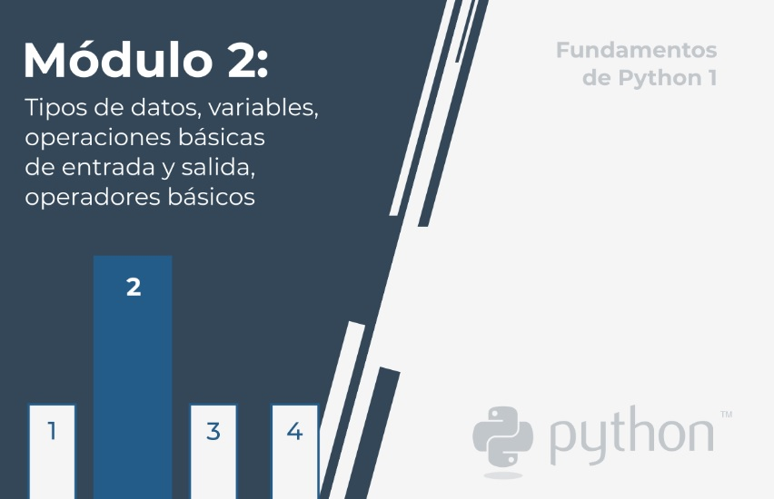

# **Módulo 2 - Fundamentos de Python 1**
## **Tipos de datos, variables, operaciones básicas de entrada y salida, operadores básicos**

En este módulo, aprenderás:  

- Cómo escribir y ejecutar programas simples en Python.
- Qué son los literales, operadores y expresiones en Python.
- Qué son las variables y cuáles son las reglas que las gobiernan.
- Cómo realizar operaciones básicas de entrada y salida.

  

