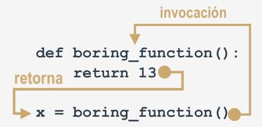

# **Módulo 4 - Fundamentos de Python 1**
## **Regresando el resultado de una función**

## **Efectos y resultados: la instrucción `return`**
Todas las funciones presentadas anteriormente tienen algún tipo de efecto: producen un texto y lo envían a la consola.

Por supuesto, las funciones, al igual que las funciones matemáticas, pueden tener resultados.

Para lograr que las **funciones devuelvan un valor** (pero no solo para ese propósito) se utiliza la instrucción `return` (regresar o
retornar).

Esta palabra nos da una idea completa de sus capacidades. Nota: es una **palabra clave reservada** de Python.

La instrucción `return` tiene **dos variantes diferentes**: Considerémoslas por separado.


## **`return` sin una expresión**
La primera consiste en la palabra reservada en sí, sin nada que la siga.

Cuando se emplea dentro de una función, provoca la **terminación inmediata de la ejecución de la función, y un retorno**
**instantáneo (de ahí el nombre) al punto de invocación**.

Nota: si una función no está destinada a producir un resultado, **emplear la instrucción `return` no es obligatorio**, se ejecutará
implícitamente al final de la función.

De cualquier manera, se puede emplear para **terminar las actividades de una función**, antes de que el control llegue a la última
línea de la función.

---------------------------------

Consideremos la siguiente función:
```
def happy_new_year(wishes = True):
    print("Tres...")
    print("Dos...")
    print("Uno...")
    if not wishes:
        return
    
    print("¡Feliz año nuevo!")
```

Cuando se invoca sin ningún argumento:
`happy_new_year()`

La función produce un poco de ruido; la salida se verá así:
```
Tres...
Dos...
Uno...
¡Feliz año nuevo!
```

Al proporcionar `false` como argumento:
`happy_new_year(False)`

Se modificará el comportamiento de la función; la instrucción `return` provocará su terminación justo antes de los deseos. Esta es la
salida actualizada:
```
Tres...
Dos...
Uno...
```


## **`return` con una expresión**
La segunda variante de `return` está **extendida con una expresión**:
```
def function():
    return expression
```

Existen dos consecuencias de usarla:

- Provoca la **terminación inmediata de la ejecución de la función** (nada nuevo en comparación con la primer variante).
- Además, la función **evaluará el valor de la expresión y lo devolverá (de ahí el nombre una vez más) como el resultado de la**
**función**.

Si, este ejemplo es sencillo:
```
def boring_function():
    return 123

x = boring_function()

print("La función boring_function ha devuelto su resultado. Es:", x)
```

El fragmento de código escribe el siguiente texto en la consola:
`La función boring_function ha devuelto su resultado. Es: 123`

Vamos a investigarlo.

Analiza la siguiente imagen:



La instrucción `return`, enrriquecida con la expresión (la expresión es muy simple aquí), "transporta" el valor de la expresión al lugar
donde se ha invocado la función.

El resultado se puede usar libremente aquí, por ejemplo, para ser asignado a una variable.

También puede ignorarse por completo y perderse sin dejar rastro.

Ten en cuenta que no estamos siendo muy educados aquí: la función devuelve un valor y lo ignoramos (no lo usamos de ninguna
manera):
```
def boring_function():
    print("'Modo aburrimiento' ON.")
    return 123

print("¡Esta lección es interesante!")
boring_function()
print("Esta lección es aburrida...")
```

El programa produce el siguiente resultado:
```
¡Esta lección es interesante!
'Modo aburrimiento' ON.
Esta lección es aburrida...
```

Está mal? De ninguna manera.

La única desventaja es que el resultado se ha perdido irremediablemente.
No olvides:

- Siempre se te **permite ignorar el resultado de la función** y estar satisfecho con el efecto de la función (si la función tiene
alguno).
- Si una función intenta devolver un resultado útil, debe contener la segunda variante de la instrucción `return`.

Espera un segundo, significa esto que también hay resultados inútiles? sí, en cierto sentido.


## **Unas pocas palabras acerca de `none`**
Permítenos presentarte un valor muy curioso (para ser honestos, un valor que es ninguno) llamado `None`.

Sus datos no representan valor razonable alguno; en realidad, no es un valor en lo absoluto; por lo tanto, **no**
**debe participar en ninguna expresión**.

Por ejemplo, un fragmento de código cmo el siguiente:
`print(None + 2)`

Causará un error de tiempo de ejecución, descrito por el siguiente mensaje de diagnóstico:
`TypeError: unsupported operand type(s) for +: 'NoneType' and 'int'`

Nota: `None` es una **palabra clave reservada**.

Solo existen dos tipos de circunstancias en las que `None` se puede usar de manera segura:

- Cuando **se le asigna a una variable** (o se devuelve como **el resultado de una función**).
- Cuando **se le compara con una variable** para diagnosticar su estado interno.

Al igual que aquí: 
```
value = None
if value is None:
    print("Lo siento, no contienes ningún valor")
```

No olvides esto: si una función no devuelve un cierto valor utilizando una cláusula de expresión `return`, se
asume que **devuelve implícitamente** `none`.

Echemos un vistazo al siguiente código: 
```
def strange_function(n):
    if(n % 2 == 0):
        return True
```

Es obvio que la función `strange_function` retorna `True` cuando su argumento es par.

Qué es lo que retorna de otra manera?

Podemos usar el siguiente código para verificarlo:
```
print(strange_function(2))
print(strange_function(1))
```

Esto es lo que vemos en consola:
```
True
None
```

No te sorprendas la próxima vez que veas `None` como el resultado de la función, puede ser el síntoma de un
error sutil dentro de la función.


## **Efectos y resultados: listas y funciones**
Existen dos preguntas adicionales que deben responderse aquí.

La primera es: **Se puede enviar una lista a una función como un argumento?

Por supuesto que se puede! cualquier entidad reconocible por Python puede desempeñar el papel de un   
argumento de función, aunque debes asegurarte de que la función sea capaz de hacer uso de él.

Entonces, si pasas una lista a una función, la función tiene que manejarla como una lista.

Una función como la siguiente:
```
def list_sum(lst):
    s = 0
    
    for elem in lst:
        s += elem
    
    return s
```

y se invoca así:
`print(list_sum([5, 4, 3]))`

Retorna `12` como resultado, pero habrá problemas si la invocas de esta manera:
`print(list_sum(5))`

La respuesta de Python será la siguiente:
`TypeError: 'int' object is not iterable`

Esto se debe al hecho de que el **bucle `for` no pede iterar un solo valor entero**.

La segunda pregunta es: **Puede una lista ser el resultado de una función?**

Sí, por supuesto! Cualquier entidad reconocible por Python puede ser un resultado de función.
Observa el código en el editor. 
```
def strange_list_fun(n):
    strange_list = []
    
    for i in range(0, n):
        strange_list.insert(0, i)
    
    return strange_list

print(strange_list_fun(5))
```

La salida del programa será así:
`[4, 3, 2, 1, 0]`

Ahora puedes escribir funciones con y sin resultados.

Vamos a profundizar un poco más en los problemas relaccionados con las variables en las funciones. Esto es
esencial para crear funciones efectivas y seguras.


## **Puntos clave**

1. Puedes emplear la palabra clave reservada `return` para decirle a una función que devuelva algún valor. La instrucción `return`
termina la función. Por ejemplo:
```
def multiply(a, b):
    return a * b

print(multiply(3, 4))    # salida: 12


def multiply(a, b):
    return

print(multiply(3, 4))    # salida: None
```

2. El resultado de una función se puede asignar fácilmente a una variable, por ejemplo:
```
def wishes():
    return "¡Felíz Cumpleaños!"

w = wishes()

print(w)    # salida:¡Felíz Cumpleaños!
```

Observa la diferencia en la salida en los siguientes dos ejemplos:
```
# Ejemplo 1
def wishes():
    print("Mis deseos")
    return "Felíz Cumpleaños"

wishes()    # salida: Mis deseos


# Ejemplo 2
def wishes():
    print("Mis deseos")
    return "Felíz Cumpleaños"

print(wishes())

# salida: Mis deseos
#         Felíz Cumpleaños
```

3. Puedes usar una lista como argumento de una función, por ejemplo:
```
def hi_everybody(my_list):
    for name in my_list:
        print("Hola,", name)

hi_everybody(["Adán", "Juan", "Lucía"])
```

4. Una lista también puede ser un resultado de función, por ejemplo:
```
def create_list(n):
    my_list = []
    for i in range(n):
        my_list.append(i)
    return my_list

print(create_list(5))
```