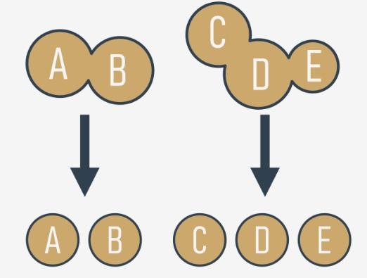
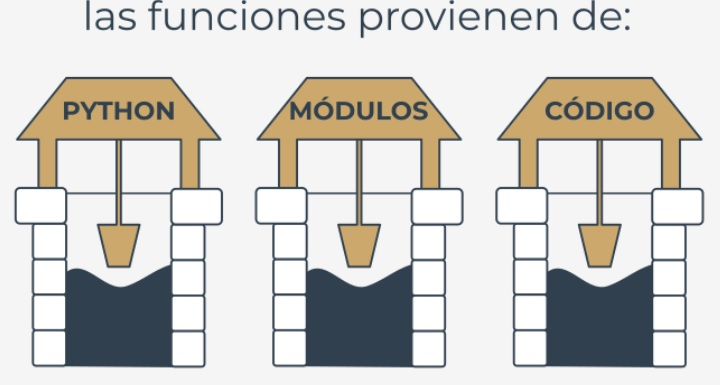
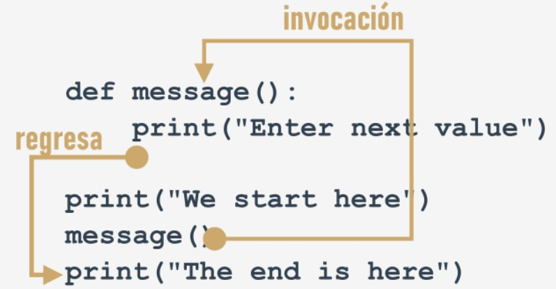

# **Módulo 4 - Fundamentos de Python 1**
## **Funciones, tuplas, diccionarios, exceptiones y procesamiento de datos**

En este módulo, se cubrirán los siguientes temas:

- Estructuración de códgo y el concepto de función.
- Invocación de funciones y devolución de resultados de una función.
- Alcance de nombres y sombreado de variables.
- Tuplas y su propósito: construcción y uso de tuplas.
- Diccionarios y su propósito: construcción y uso de diccionarios.
- Introducción a las excepciones en Python.


## **Por qué necesitamos funciones?**
Hasta ahora has implementado varias veces el uso de **funciones**, pero sólo se han visto algunas de sus ventajas. Solo se han
invocado funciones para utilizarlas como herramientas, con el fin de hacer la vida más fácil, y para simplificar tareas tediosas y 
repetitivas.

Cuando se desea mostrar o imprimir algo en consola se utiliza ´print()´. Cuando se desea leer el valor de una variable se emplea
`input()`, combinados posiblemente con `int()` o `float()`.

También se ha hecho uso de alguinos **métodos**, los cuales también son funciones, pero declarados de una manera muy específica.

Ahora aprenderás a escribir tus propias funciones, y como utilizarlas. Escribiremos varias de ellas juntos, desde muy sencillas hasta
algo complejas. Se requerirá de tu concentración y atención.

Muy a menudo ocurre que un cierto fragmento de código **se repite muchas veces en un programa**. Se repite de manera literal o,
con algunas modificaciones menores, empleando algunas otras variables dentro del programa. También ocurre que un programador
ha comenzado a copiar y pegar ciertas partes del código en más de una ocasión en el mismo programa.

Puede ser muy frustrante percatarse de repente que existe un error en el código copiado. El programador tendrá que escarbar
bastante para encontrar todos los lugares en el código donde hay que corregir el error. Además, existe un gran riesgo de que las
correcciones produzcan errores adicionales.

Definamos la primera condición por la cual es buena idea comenzar a escribir funciones propias: **si un fragmento de código**
**comienza a aparecer en más de una ocasión, considera la posibilidad de aislarlo en la forma de una función** invocando la
función desde el lugar en el que originalmente se encontraba.

Puede suceder que el algoritmo que se desea implementar sea tan complejo que el código comience a crecer de manera incontrolada
y, derrepente, ya no se puede navegar por él tan fácilmente.

Se puede intentar solucionar este problema comentando el código, pero pronto te darás cuenta que esto empeorará la situación,
**demasiados comentarios hacen que el código sea más difiícil de leer  entender**. Algnos dicen que **una función bien escrita**
**debe ser comprensible con tan solo una mirada**.

Un buen desarrollador **divide el código** (o mejor dicho: el problema) en piezas aisladas, y **codifica cada una de ellas en la forma de**
**una función**.

Esto simplifica considerablemente el trabajo del programa, debido a que cada pieza se codifica por separado y consecuentemente se
prueba por separado. A este proceso se le llama comúnmente **descomposición**.



Existe una segunda condición: **si un fragmento de código se hace tan extenso que leerlo o entenderlo se hace complicado,**
**considera dividirlo en pequeños problemas por separado e implementa cada uno de llos como una función independiente**.

Esta descomposición continúa hasta que se obtiene un conjunto de funciones cortas, fáciles de comprender y probar.


## **Descomposición**
Es muy común que un programa sea tan largo y complejo que no puede ser asignado a un solo desarrollador, y en su lugar un **equipo**
**de desarrolladores** trabajarán en él. El problema, debe ser dividido entre varios desarrolladores de una manera en que se pueda
asegurar su eficiencia y cooperación.

Es inconcebible que más de un programador deba escribir el mismo código al mismo tiempo, por lo tanto, el trabajo debe de ser
dividido entre todos los miembros del equipo.

Este tipo de descomposición tiene diferentes propósitos, no solo se trata de **compartir el trabajo**, sino también de **compartir la**
**responsabilidad** entre varios desarrolladores.

Cada uno debe escribir un conjunto bien definido y claro de funciones, las cuales al ser **combinadas dentro de un módulo** (esto se
clarificará un poco más adelante) nos dará como resultado el producto final.

Esto nos lleva directamente a la tercera condición: si se va a dividir el trabajo entre varios programadores, **se debe descomponer el**
**problema para permitir que el producto sea implementado como un conjunto de funciones escritas por separado empacadas**
**juntas en diferentes módulos**.


## **De dónde provienen las funciones?**
En general, las funciones provienen de almenos tres lugares:

- Del propio Python: varias funciones (como `print()`) son una **parte integral de Python**, y siempre están disponibles sin algún
esfuerzo adicional del programador; se les llama a estas **funciones integradas**.

- De los **módulos preinstalados** de Python: Muchas de las funciones, las cuales comúnmente son menos utilizadas que las
integradas, están disponibles en módulos instalados junto con Python; para poder utilizar estas funciones el programador
debe realizar algunos pasos adicionales (se explicará acerca de esto en un momento).´

- **Directamente del código**: Tu puedes escribir tus propias funciones, colocarlas dentro del código, y usarlas libremente.

- Existe una posibilidad más, pero se relaciona con clases, se omitirá por ahora.




## **Tu primera función**
Observa el fragmento de código en el editor:

```
print("Ingresa un valor: ")
a = int(input())

print("Ingresa un valor: ")
b = int(input())

print("Ingresa un valor: ")
c = int(input())
```

Es bastante sencillo, es un ejemplo de como **transformar una parte de código que se está repitiendo en una**
**función**.

El mensaje enviado a la consola por la función `print()` es siempre el mismo. El código es funcional y no
contiene errores, sin embargo imagina que tendrías que hacer si tu jefe pidiera cambiar el mensaje para que
fuese más cortés, por ejemplo, que comience con la frase `"Por favor"`,

Tendrías que tomar algo de tiempo para cambiar el mensaje en todos los lugares donde aparece (podrías hacer
uso de copiar y pegar, pero eso no lo haría más sencillo). Es muy probable que cometas errores durante el
proceso de corrección, eso traería frustración a ti y a tu jefe.

Es posible separar ese código *repetido*, darle un nombre y hacerlo reutilizable? Significaría que **el cambio**
**hecho en un solo lugar será propagado a todos los lugares donde se utilice**.

Para que esto funcione, dicho código debe ser invocado cada vez que se requiera.

Es posible, esto es exactamente para lo que existen las funciones.

Cómo es que se crea dicha función? 

Se necesita **definirla**. Aquí, la palabra *definir* es significativa.

Así es como se ve la definición más simple de una función: 

```
def nombre_funcion():
    comando1
    comando2
    etc...
```

- Siempre se comienza con la **palabra reservada** `def` (que significa *definir*).
- Después de `def` va el **nombre de la función** (las reglas para darle nombre a las funciones son las
mismas que para las variables).
- Después del nombre de la función, hay un espacio para un par de **paréntesis** (ahora no contienen nada,
pero eso cambiará pronto)
- La línea debe terminar con **dos puntos**.
- La línea inmediatamente después de `def` marca el comienz del **cuerpo de la función** - donde varias o
(almenos una) **instrucción anidada** será ejecutada cada vez que la función sea invocada; nota: la **función**
**termina donde el anidamiento termina**, se debe ser cauteloso.

A continuación se **definirá** la función. Se llamará `message`.
```
def message():
    print("Ingresa un valor: ")
```

La función es muy sencilla, pero completamente **utilizable**. Se ha nombrado `message`, pero esto es opcional,
tu puedes cambiaro. Hagamos uso de ella.

El código ahora contiene la definición de la función:
```
def message():
    print("Ingresa un valor: ")

print("Se comienza aquí.")
print("Se termina aquí.")
```

Nota: no se está utilizando la función, no se está **invocando** en el código.

Al correr el programa, se mostrará lo siguiente:
```
Se comienza aquí.
Se termina aquí.
```

Esto significa que Python lee la definición de la función y la recuerda, pero no la ejecuta sin tu permiso.

Se ha modificado el código, se ha insertado la **invocación de la función** entre los dos mensajes:
```
def message():
    print("Ingresa un valor: ")

print("Se comienza aquí.")
message()
print("Se termina aquí.")
```  

La salida ahora se ve diferente:
```
Se comienza aquí.
Ingresa un valor: 
Se termina aquí.
```

Prueba el código, modifícalo, experimenta con el.


## **El funcionamiento de las funciones**
Observa la imagen:



Intenta mostrarte el proceso completo: 

- Cuando se **invoca** una función, Python recuerda el lugar donde esto ocurre y *salta* hacia dentro de la función invocada.
- El cuerpo de la función es entonces **ejecutado**.
- Al llegar al final de la función, Python **regresa** al lugar inmediato depués de donde ocurrió la invocación.

Existen dos consideraciones muy importantes, la primera de ellas es:

**No se debe invocar una función antes de que se haya definido.**

Recuerda: Python lee el código de arriba hacia abajo. No va a adelantarse en el código para determinar si la función invocada está
definida más adelante, el lugar correcto para definirla es antes de ser invocada.

Se ha insertado un error en el siguiente código, puedes notar la diferencia?
```
print("Se comienza aquí.")
message()
print("Se termina aquí.")


def message():
    print("Ingresa un valor: ")
```

Se ha movido la función al final del código. Podrá Python encontrarla cuando la ejecución llegue a la invocación?

No, no podrá. El mensaje de error dirá: 
```
NameError: name 'message' is not defined
```

No intentes forzar a Python a encontrar funciones que no están definidas en el lugar correcto.

La segunda consideración es más sencilla:

**Una función y una variable no pueden compartir el mismo nombre**.

El siguiente fragmento de código es erróneo:
```
def message():
    print("Ingresa un valor: ")

message = 1
```

El asignar un valor al nombre "message" causa que Python olvide su rol anterior. La función con el nombre de `message` ya no estará
disponible.

Afortunadamente, es posible **combinar o mezclar el código con las funciones** - No es forzoso colocar todas las funciones al inicio del
archivo fuente.

Observa el siguiente código: 
```
print("Se comienza aquí.")

def message():
    print("Ingresa un valor: ")

message()

print("Se termina aquí.")
```

Puede verse extraño, pero es completamente correcto, y funciona como se necesita.

Regresemos al ejemplo inicial para implementar la función de manera correcta:
```
def message():
    print("Ingresa un valor: ")

message()
a = int(input())
message()
b = int(input())
message()
c = int(input())
```

El modificar el mensaje de entrada es ahora sencillo: se puede hacer con solo **modificar el código una única vez** - dentro del cuerpo
de la función.

Abre Sandbox, e inténtalo tu mismo.


## **Puntos clave**
1. Una **función** es un bloque de código que realiza una tarea específica cuando la función es llamada (invocada). Las funciones son
útiles para hacer que el código sea reutilizable, que este mejor organizado y más legible. Las funciones contienen parámetros y
pueden regresar valores.

2. Existen almenos cuatro tipo de funciones básicas en Python:
- **Funciones integradas**, las cuales son partes importantes de Python (como lo es la función `print()`). Puedes ver una lista
completa de las funciones integradas de Python en el siguiente [enlace](https://docs.python.org/3/library/functions.html).
- **Módulos preinstalados**, se hablará más de ellas en el curso *Fundamentos de Python 2*.
- **Funciones definidas por el usuario**, las cuales son escritas por los programadores para los programadores, puedes escribir tus
propias funciones y utilizarlas libremente en tu código.
- Las funciones `lambda` (aprenderás acerca de ellas en el curso *Fundamentos de Python 2*).

3. Las funciones propias se pueden definir utilizando la palabra reservada `def` y con la siguiente sintaxis:
```
def tu_funcion(parametros opcionales):
    # el cuerpo de la función
```

Se puede definir una función sin que haga uso de argumentos, por ejemplo:
```
def message():    # definiendo una función
    print("Hello")    # cuerpo de la función

message()    # invocación de la función
```

También es posible definir funciones con argumentos, como la siguiente que contiene un solo parámetro:
```
def hello(name):    # definiendo una función
    print("Hola,", name)    # cuerpo de la función


name = input("Ingresa tu nombre: ")

hello(name)    # invocación de la función
```
Se hablará más de las funciones parametrizadas en la siguiente sección. 